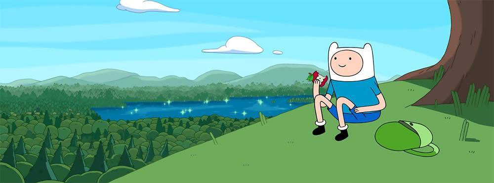

<h1 align="center">Hi there, I'm [Your Name] 👋</h1>

<h3 align="center">
  Aspiring Software Developer & Enthusiast
</h3>

  I do not currently work in the field, but I am passionate about technology and actively building my skills to launch a career in software development.

  

    📍 <b>Location:</b> [City, Country] 
    🎓 <b>Education:</b> Studying [Course Name] at [University Name] 
    🎯 <b>Focus:</b> Improving my command of Full Stack technologies and Software Architecture.
  

  
## 📌 Pinned Repositories 

## &#x1f4c8; GitHub Stats

  ---

  <h3>Languages and Tools</h3>
  

    
    
    
    
    
    
     
     
     
    
    
  

  ---

  <h3>Connect with me</h3>
  

    
  

